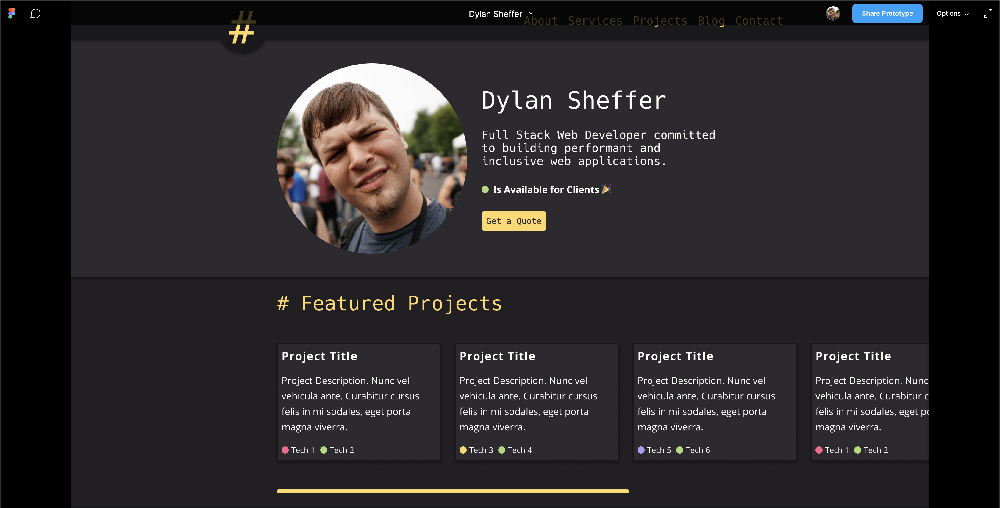

import { Aesthetic } from '../../components/Aesthetic.js';

With the launch of this website, I am very excited to announce that I am finally an independent developer! I have created this site (the very one you're reading this on) as a reflection of what I value in web applications. It's fast, it's accessible, and it uses the colors of my favorite code editor theme, [Monokai Pro](https://monokai.pro/) 😍. Overall, I am very pleased with how the website came together and I hope you enjoy it as much as I do.

## The Stack

I decided to build this website using [Gatsby](https://www.gatsbyjs.org/). I have been a fan of Gatsby since v1 and I knew that whatever I build with it would be incredibly fast and would be easy to deploy.

My styling is written with [styled-components](https://styled-components.com/). I love being able to easily write scoped CSS without the ceremony of the BEM methodology (and remembering if the `--` or the `__` come first 😅) . It is also refreshing being able to use actual CSS/SCSS-like syntax directly in my React components.

However, my favorite feature of styled-components is the [`as`](https://styled-components.com/docs/api#as-polymorphic-prop) prop. The `as` prop lets you use the styles of one element (let's say a button) and apply it directly to another element (a link). This allows you to easily use semantic markup (necessary for both accessibility and SEO), while keeping the visual presentation you desire. A+, 💯, well done!

The content of my posts are written in [MDX](https://mdxjs.com/). MDX is regular-ole markdown with the ability to add in JSX components. I decided to go with this approach because I pretty much write everything using markdown and I thought that it would be convenient to be able to embed React components into my posts easily. I do have some concerns about backwards compatibility for my posts in the future, but I anticipate that the components I choose to embed will be easily convertible into what ever futuristic format I'll use down the road.

The site is hosted on [Netlify](https://www.netlify.com/) and uses their convenient forms service for handling my contact form. Netlify has really figured out how to make deploying websites easy. I just had to connect Netlify to my GitHub repo and BOOM! it's online and it has automatic CI/CD 🤯! I was also able to preserve the old version of my website at my domain, while automatically deploying the new version to a separate domain while it was under development.

## My Process

The process for creating my ideal business/portfolio website is a combination of thinking about what my needs are for the site, deciding on a general aesthetic, and scavenging though tons of other people’s portfolio sites for inspiration. (Shout outs to [Wes Bos](https://wesbos.com/), [Sara Soueidan](https://www.sarasoueidan.com/), [Kevin Griffin](https://consultwithgriff.com/), and [Byurhan Beyzat](https://www.byurhanbeyzat.com/))

Once I had my list of features, inspirations, hopes, dreams, and desired <Aesthetic>aesthetic</Aesthetic>, I hopped into [Figma](https://www.figma.com/) and started the tried and true `"draw rectangles until you like the layout"` method. Then, I created components that fit within those rectangles, and eventually I ended up with a mock-up that starts to resemble a website!

From there, I used Figma’s excellent prototyping tool to make the design come to life by adding the ability to scroll and click links, so I could get a feel for what the final product would look like and so I can easily share it to friends. I sent it to all my friends in the open-sourced collective [Our Weekend Project](http://github.com/our-weekend-project/) (OWP 👌) and after a few iterations, came to a general idea of what the end product should be.

[Link to the live prototype](https://www.figma.com/proto/zRO9QTUkG71M1RvxEfZhDq/Dylan-Sheffer?chrome=DOCUMENTATION&node-id=21%3A629&scaling=min-zoom)

Now that I had a design that I felt good about, it was time to finally commit it to code. Since Figma’s colors and constraint system are so similar to how the web works, I was able to easily put together the layout and global styles . After a few weeks of chipping away at the little details and it’s functionality, the site was ready for v1!

## Final Thoughts

I really enjoyed building this website. Gatsby makes it so easy to build modern websites that are both performant and accessible. The backend (or lack there of) would be concerning for client work because most people don’t want to write straight up markdown. However, it works out perfectly for me because I _am_ down with the markdown 🗿 and I want to have more control over my content.

I hope you all enjoy your time here and are happy and healthy. Thank you for reading 🌹
